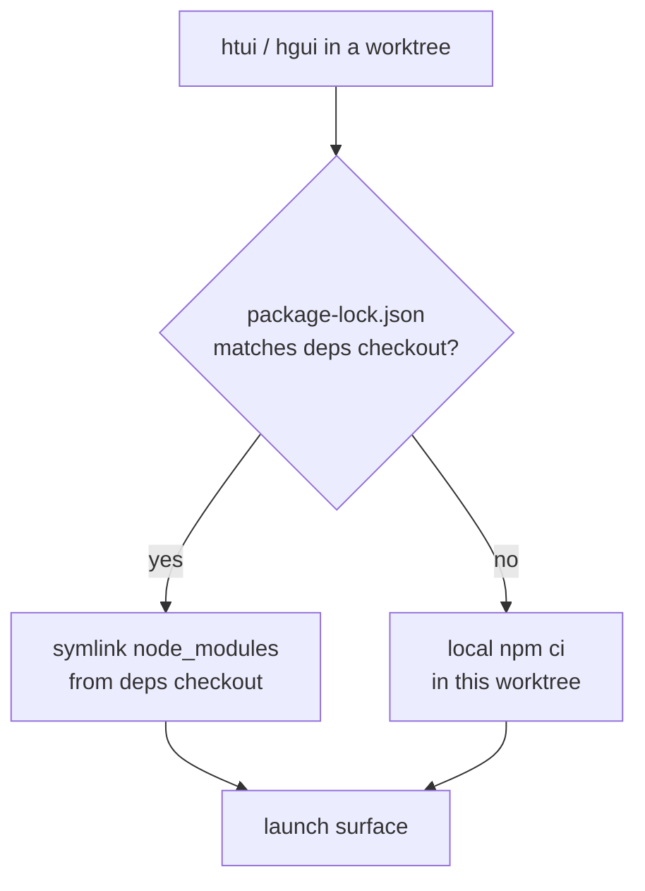

# TUI & Desktop from Worktrees

The Python core runs fine from any [git worktree](../user-guide/git-worktrees.md) — `cd` in and `hermes` just works. The two TypeScript surfaces do not: `ui-tui/` and `apps/desktop/` each need a populated `node_modules`, and a fresh `npm ci` per worktree is slow and duplicates gigabytes across every branch you have checked out.

`htui` and `hgui` are two shell helpers that close that gap. Each launches its surface **from the current worktree** while borrowing `node_modules` from one canonical checkout — so a throwaway branch costs a symlink, not an install.

They're developer conveniences, not shipped commands. Drop them in `~/.zshrc`; adapt paths to taste.

## The deps-sharing model

One checkout is the **deps checkout** — the one place you actually run `npm install`. Every other worktree links against it, and only re-installs locally when its lockfile diverges (a branch that bumps a dependency must not silently run against stale packages).



Two env vars name the canonical checkout:

| Variable | Meaning |
|----------|---------|
| `HERMES_MAIN_CHECKOUT` | The deps checkout — where `node_modules` really lives, and whose `.venv/bin/python` runs the backend. |
| `HERMES_GUI_DEPS_CHECKOUT` | Where the desktop deps (`apps/desktop/node_modules`) live. Defaults to `HERMES_MAIN_CHECKOUT`; override only if you keep desktop deps elsewhere. |

Neither is read by Hermes itself — they're private to these helpers. The variables Hermes *does* read are covered in [Environment Variables](../reference/environment-variables.md).

## `htui` — TUI from the worktree

The Ink TUI has a dev path already: `hermes --tui --dev` runs the TypeScript sources via `tsx` instead of the prebuilt bundle. `htui` is a one-liner over it that also points the run at the current worktree's `ui-tui/`:

```bash
htui() {
  local root
  root="$(_hermes_root)" || { echo "htui: not in a Hermes checkout" >&2; return 1; }
  ( cd "$root" && PYTHONPATH="$root" \
      "$HERMES_MAIN_CHECKOUT/.venv/bin/python" -m hermes_cli.main --tui --dev "$@" )
}
```

`--dev` compiles from source, so it links `ui-tui/node_modules` from `HERMES_MAIN_CHECKOUT` when the root lockfile matches and installs locally otherwise (see [`_hermes_root` / linking helpers](#shared-helpers)).

:::warning `--dev` and `HERMES_TUI_DIR` are mutually exclusive
`HERMES_TUI_DIR` points Hermes at a *prebuilt* bundle (Nix, system packages), which has no source to hot-reload. If it's set in your shell, `hermes --tui --dev` exits with an error. Run `unset HERMES_TUI_DIR` before `htui`.
:::

## `hgui` — desktop app from the worktree

The desktop app is heavier: it needs `node_modules` at both the repo root and `apps/desktop/`, a Vite dev server pinned to port `5174`, and a Python backend. `hgui` wires all of it against the current worktree:

```bash
hgui() {
  local root deps desktop
  root="$(_hermes_root)" || { echo "hgui: not in a Hermes checkout" >&2; return 1; }
  deps="${HERMES_GUI_DEPS_CHECKOUT:-$HERMES_MAIN_CHECKOUT}"
  desktop="$root/apps/desktop"

  # Borrow deps when locks match; otherwise install locally in the worktree.
  if cmp -s "$root/package-lock.json" "$deps/package-lock.json"; then
    _hermes_link_deps "$desktop" "$deps/apps/desktop"
    _hermes_link_deps "$root" "$deps"
  else
    ( cd "$root" && npm ci ) || return 1
  fi

  # Vite is fixed at 5174 — evict a stale session from another hgui.
  lsof -t -i:5174 >/dev/null 2>&1 && killport 5174

  # Electron often survives Ctrl+C without reaping its ephemeral backends.
  trap '_hermes_gui_cleanup "$root"' INT TERM EXIT

  ( cd "$desktop"
    export PATH="$root/node_modules/.bin:$PATH"
    HERMES_DESKTOP_HERMES_ROOT="$root" \
    HERMES_DESKTOP_PYTHON="$HERMES_MAIN_CHECKOUT/.venv/bin/python" \
    HERMES_DESKTOP_IGNORE_EXISTING=1 \
    HERMES_DESKTOP_CWD="$root" \
    npm run dev )
}
```

The desktop env vars it sets are all real backend-resolution knobs:

| Variable | Role in `hgui` |
|----------|----------------|
| `HERMES_DESKTOP_HERMES_ROOT` | Runs the backend from **this worktree**, not the packaged/PATH `hermes`. |
| `HERMES_DESKTOP_PYTHON` | Reuses the deps checkout's venv instead of re-resolving a Python. |
| `HERMES_DESKTOP_IGNORE_EXISTING` | Ignores any `hermes` on `PATH` so it can't shadow the worktree. |
| `HERMES_DESKTOP_CWD` | Opens the desktop chat rooted at the worktree. |

Two footguns `hgui` handles that a bare `npm run dev` does not:

- **Port `5174` is fixed.** A second `hgui` collides with the first's Vite server; the helper kills the stale one first.
- **Orphaned children.** Electron frequently survives `Ctrl+C` through `concurrently` without reaping the ephemeral `dashboard --port 0` backend or the Vite process. The `EXIT`/`INT`/`TERM` trap runs a cleanup that terminates the Electron shell, the `:5174` listener, and any `--port 0` dashboard it spawned.

## Shared helpers

Both functions resolve the enclosing checkout and link deps the same way:

```bash
# The enclosing worktree, verified as a real Hermes checkout.
_hermes_root() {
  local root
  root="$(git rev-parse --show-toplevel 2>/dev/null)" || return 1
  [[ -f "$root/hermes_cli/main.py" && -d "$root/ui-tui" ]] && print -r "$root"
}

# Symlink node_modules from the deps checkout — never over an existing tree.
_hermes_link_deps() {
  local target="${1%/}" source="${2%/}"
  [[ -d "$source/node_modules" ]] || return 1
  [[ -e "$target/node_modules" ]] || ln -s "$source/node_modules" "$target/node_modules"
}

# Reap ephemeral backends Electron leaves behind on exit.
_hermes_gui_cleanup() {
  local root="$1"
  [[ -n "$root" ]] && pkill -TERM -f "${root}/apps/desktop/node_modules/electron" 2>/dev/null
  lsof -t -i:5174 >/dev/null 2>&1 && killport 5174
  pgrep -f 'hermes_cli\.main.*dashboard.*--port 0' 2>/dev/null | xargs -r kill -TERM 2>/dev/null
}
```

`killport` is a small helper of your own (`lsof -ti:$1 | xargs kill`); substitute your preferred incantation.

:::info Why link only when locks match
A symlink to a divergent `node_modules` is worse than no install — the worktree would build against packages its own lockfile never declared. Byte-comparing `package-lock.json` is the cheap, exact guard: same lock ⇒ safe to borrow; different lock ⇒ `npm ci` locally. Vite realpaths symlinks before enforcing `server.fs.allow`, which is why `apps/desktop/vite.config.ts` whitelists the real `node_modules` location.
:::

## See also

- [Git Worktrees](../user-guide/git-worktrees.md) — the isolation model these helpers build on
- [TUI](../user-guide/tui.md) — `hermes --tui --dev` and the `HERMES_TUI_DIR` prebuild path
- [Desktop App](../user-guide/desktop.md) — building from source and the backend resolution ladder
- [`apps/desktop/README.md`](https://github.com/NousResearch/hermes-agent/blob/main/apps/desktop/README.md) — dev server, sandbox script, and packaging
- [Environment Variables](../reference/environment-variables.md) — every `HERMES_*` variable Hermes reads
