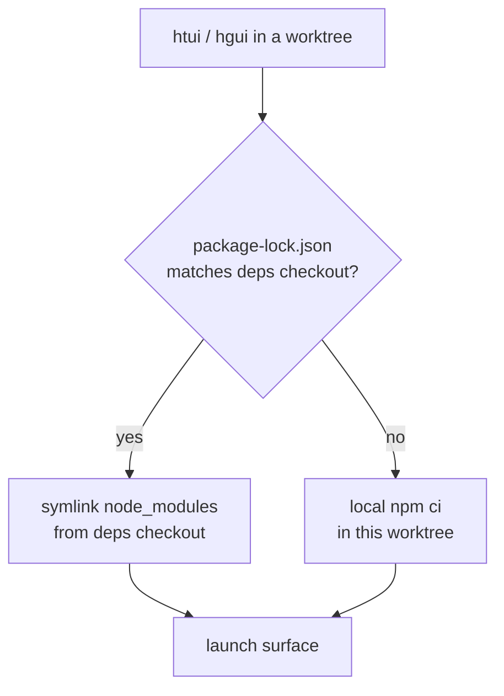

# TUI & Desktop from Worktrees

The Python core runs fine from any [git worktree](../user-guide/git-worktrees.md) — `cd` in and `hermes` just works. The two TypeScript surfaces do not: `ui-tui/` and `apps/desktop/` each need a populated `node_modules`, and a fresh `npm ci` per worktree is slow and duplicates gigabytes across every branch you have checked out.

`htui` and `hgui` are two shell helpers that close that gap. Each launches its surface **from the current worktree** while borrowing `node_modules` from one canonical checkout — so a throwaway branch costs a symlink, not an install.

They're developer conveniences, not shipped commands. Drop them in `~/.zshrc`; adapt paths to taste.

## The deps-sharing model

One checkout is the **deps checkout** — the one place you actually run `npm install`. Every other worktree links against it, and only re-installs locally when its lockfile diverges (a branch that bumps a dependency must not silently run against stale packages).


```mermaid
flowchart TD
    A[htui / hgui in a worktree] --> B{package-lock.json<br/>matches deps checkout?}
    B -- yes --> C[symlink node_modules<br/>from deps checkout]
    B -- no --> D[local npm ci<br/>in this worktree]
    C --> E[launch surface]
    D --> E
```

Two env vars name the canonical checkout:

| Variable | Meaning |
|----------|---------|
| `HERMES_MAIN_CHECKOUT` | The deps checkout — where `node_modules` really lives, and whose `.venv/bin/python` runs the backend. |
| `HERMES_GUI_DEPS_CHECKOUT` | Where the desktop deps (`apps/desktop/node_modules`) live. Defaults to `HERMES_MAIN_CHECKOUT`; override only if you keep desktop deps elsewhere. |

Neither is read by Hermes itself — they're private to these helpers. The variables Hermes *does* read are covered in [Environment Variables](../reference/environment-variables.md).

## `htui` — TUI from the worktree

The Ink TUI has a dev path already: `hermes --tui --dev` runs the TypeScript sources via `tsx` instead of the prebuilt bundle. `htui` is a one-liner over it that also points the run at the current worktree's `ui-tui/`:

```bash
htui() {
  local root
  root="$(_hermes_root)" || { echo "htui: not in a Hermes checkout" >&2; return 1; }
  ( cd "$root" && PYTHONPATH="$root" \
      "$HERMES_MAIN_CHECKOUT/.venv/bin/python" -m hermes_cli.main --tui --dev "$@" )
}
```

`--dev` compiles from source, so it links `ui-tui/node_modules` from `HERMES_MAIN_CHECKOUT` when the root lockfile matches and installs locally otherwise (see [`_hermes_root` / linking helpers](#shared-helpers)).

:::warning `--dev` and `HERMES_TUI_DIR` are mutually exclusive
`HERMES_TUI_DIR` points Hermes at a *prebuilt* bundle (Nix, system packages), which has no source to hot-reload. If it's set in your shell, `hermes --tui --dev` exits with an error. Run `unset HERMES_TUI_DIR` before `htui`.
:::

## `hgui` — desktop app from the worktree

The desktop app needs dependencies at both the repo root and `apps/desktop/`, a Vite server, and a Python backend. The stock `npm run dev` pins Vite to `5174`; Electron also defaults to CDP port `9222` and takes a single-instance lock on its user-data directory. Changing only the Vite port is not enough to run two desktops.

This **zsh** example gives each launch an explicit slot (`HGUI_SLOT`, default `0`). Use a different slot in each terminal. It uses the [shared helpers](#shared-helpers) below and requires `lsof`:

```bash
hgui() (
  local root deps desktop slot="${HGUI_SLOT:-0}" vite_port cdp_port port
  [[ "$slot" == [0-9] ]] || { print -u2 'hgui: HGUI_SLOT must be 0-9'; return 1; }
  vite_port=$((5174 + slot))
  cdp_port=$((9222 + slot))
  for port in "$vite_port" "$cdp_port"; do
    if lsof -nP -t -iTCP:"$port" -sTCP:LISTEN >/dev/null 2>&1; then
      print -u2 "hgui: port $port is busy; choose another HGUI_SLOT"
      return 1
    fi
  done

  root="$(_hermes_root)" || { print -u2 'hgui: not in a Hermes checkout'; return 1; }
  deps="${HERMES_GUI_DEPS_CHECKOUT:-$HERMES_MAIN_CHECKOUT}"
  desktop="$root/apps/desktop"

  if cmp -s "$root/package-lock.json" "$deps/package-lock.json"; then
    _hermes_link_deps "$desktop" "$deps/apps/desktop" || return 1
    _hermes_link_deps "$root" "$deps" || return 1
  else
    ( cd "$root" && npm ci ) || return 1
  fi

  cd "$desktop" || return 1
  export PATH="$desktop/node_modules/.bin:$root/node_modules/.bin:$PATH"
  export HERMES_DESKTOP_HERMES_ROOT="$root"
  export HERMES_DESKTOP_PYTHON="$HERMES_MAIN_CHECKOUT/.venv/bin/python"
  export HERMES_DESKTOP_CWD="$root"
  export HERMES_DESKTOP_DEV_SERVER="http://127.0.0.1:$vite_port"
  export HERMES_DESKTOP_CDP_PORT="$cdp_port"
  export HERMES_DESKTOP_USER_DATA_DIR="${XDG_CACHE_HOME:-$HOME/.cache}/hermes-hgui/slot-$slot"
  # A userData override would otherwise also relocate the agent's home.
  export HERMES_HOME="${HERMES_HOME:-$HOME/.hermes}"
  export XCURSOR_SIZE=24

  # Mirror the dev scripts, replacing their fixed ports. No repo edits needed.
  concurrently -k -n "vite,electron" \
    "node scripts/assert-root-install.mjs && npm run clean:renderer && vite --host 127.0.0.1 --port $vite_port --strictPort" \
    "tsc --build tsconfig.electron.json && wait-on http://127.0.0.1:$vite_port && node scripts/bundle-electron-main.mjs --dev && electron ."
)
```

For example, after setting `HERMES_MAIN_CHECKOUT` and sourcing the helpers:

```bash
# Terminal 1: main checkout
cd "$HERMES_MAIN_CHECKOUT"
HGUI_SLOT=0 hgui

# Terminal 2: an existing worktree
cd /path/to/hermes-worktree
HGUI_SLOT=1 hgui
```

Slot `0` uses ports `5174`/`9222`; slot `1` uses `5175`/`9223`. Slots are caller-assigned, not atomically reserved: always use distinct slots for simultaneous starts. Busy ports are rejected, never evicted. Use separate checkouts for separate builds because launches in the same checkout still share build outputs.

| Variable | Role in `hgui` |
|----------|----------------|
| `HGUI_SLOT` | Helper-only slot number, `0`–`9`; not a Hermes setting. |
| `HERMES_DESKTOP_HERMES_ROOT` | Runs the backend from this worktree, not the packaged/PATH runtime. |
| `HERMES_DESKTOP_PYTHON` | Reuses the main checkout's Python environment. Adjust for an installation that uses `venv` rather than `.venv`. |
| `HERMES_DESKTOP_CWD` | Roots new desktop work in the worktree. |
| `HERMES_DESKTOP_DEV_SERVER` | Points Electron at this instance's Vite server. |
| `HERMES_DESKTOP_CDP_PORT` | Gives each instance its own renderer debugging port. |
| `HERMES_DESKTOP_USER_DATA_DIR` | Separates Electron's single-instance lock, browser storage, and desktop preferences. |
| `HERMES_HOME` | Explicitly preserves the agent home despite the Electron user-data override. |

Each slot starts with fresh desktop preferences and remembers them on later launches. This example does not copy browser storage, saved navigation, or backend ownership from a running app.

:::warning Separate desktops are not separate agent data
The default `HERMES_HOME` is shared: sessions, configuration, credentials, and profiles remain the same. Avoid editing the same conversation from both instances. For destructive tests or incompatible database migrations, pass a separate temporary `HERMES_HOME` and configure that sandbox independently.
:::

Quit the app normally or press Ctrl-C in its launching terminal. `concurrently -k` manages its own child commands, and Electron owns its backend shutdown. Do not add a global `killport`, `pkill electron`, or a sweep of all `serve`/`dashboard --port 0` processes: those can terminate another instance. Remove the old `_hermes_gui_cleanup` trap if replacing an earlier version of this helper.

## Shared helpers

Both functions resolve the enclosing checkout and link deps the same way:

```bash
# The enclosing worktree, verified as a real Hermes checkout.
_hermes_root() {
  local root
  root="$(git rev-parse --show-toplevel 2>/dev/null)" || return 1
  [[ -f "$root/hermes_cli/main.py" && -d "$root/ui-tui" ]] && print -r "$root"
}

# Symlink node_modules from the deps checkout — never over an existing tree.
_hermes_link_deps() {
  local target="${1%/}" source="${2%/}"
  [[ -d "$source/node_modules" ]] || return 1
  [[ -e "$target/node_modules" ]] || ln -s "$source/node_modules" "$target/node_modules"
}
```

:::info Why link only when locks match
A symlink to a divergent `node_modules` is worse than no install — the worktree would build against packages its own lockfile never declared. Byte-comparing `package-lock.json` is the cheap, exact guard: same lock ⇒ safe to borrow; different lock ⇒ `npm ci` locally. Vite realpaths symlinks before enforcing `server.fs.allow`, which is why `apps/desktop/vite.config.ts` whitelists the real `node_modules` location.
:::

## See also

- [Git Worktrees](../user-guide/git-worktrees.md) — the isolation model these helpers build on
- [TUI](../user-guide/tui.md) — `hermes --tui --dev` and the `HERMES_TUI_DIR` prebuild path
- [Desktop App](../user-guide/desktop.md) — building from source and the backend resolution ladder
- [`apps/desktop/README.md`](https://github.com/NousResearch/hermes-agent/blob/main/apps/desktop/README.md) — dev server, sandbox script, and packaging
- [Environment Variables](../reference/environment-variables.md) — every `HERMES_*` variable Hermes reads
